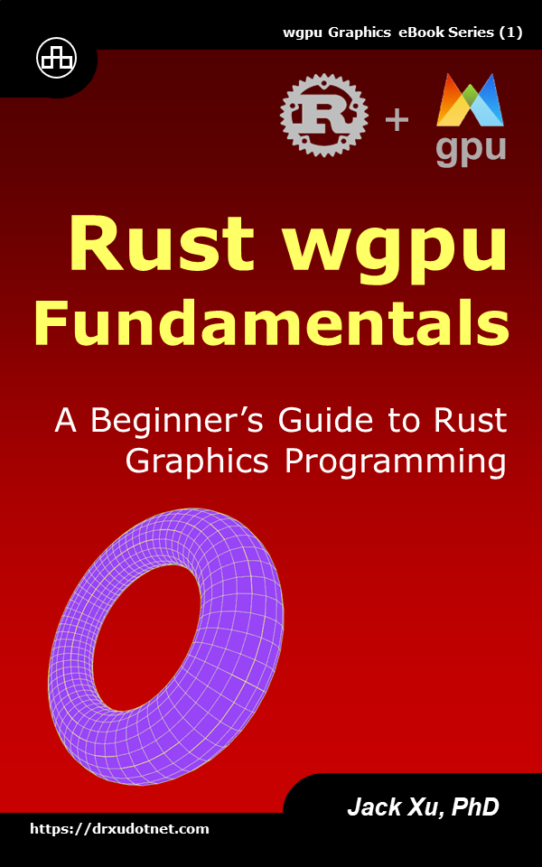

# Rust wgpu Fundamentals 
## A Beginner’s Guide to Rust Graphics Programming

This is a source code of example projects contained in the eBook ["Rust wgpu Fundamentals"](https://www.amazon.com/exec/obidos/ASIN/B0CLL5CT94/unicadinccom-20). 

